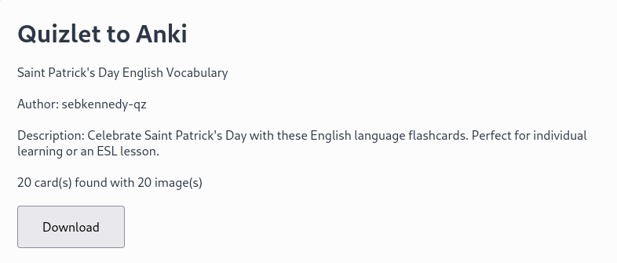

# quizlet2anki

A plain and simple web extension which can turn Quizlet sets into Anki decks.

## Screenshots

## Known Issues
- Images aren't supported yet.

## Supported Browsers
- Google Chrome
- Microsoft Edge
- Firefox

## License

AGPL 3.0 or later, with the exception of the `libs/` folder. They have their own licenses appended at the top of the file.

