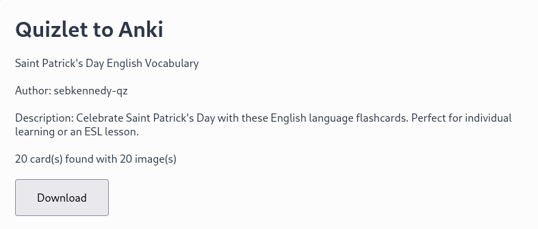
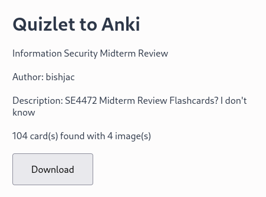

# quizlet2anki

A plain and simple web extension which can turn Quizlet sets into Anki decks.

## Screenshots

## Known Issues
- None yet.

## Supported Browsers
- Firefox (Desktop)
- Google Chrome
- Microsoft Edge
- Opera

Google Chrome, Microsoft Edge and Opera should use the [Chrome Web Store](https://chromewebstore.google.com/detail/quizlet-to-anki/cgeebapijlelpceccbapfkpoaolbiccm) listing to download it.

## License

AGPL 3.0 or later, with the exception of the `libs/` folder. They have their own licenses appended at the top of the file.

